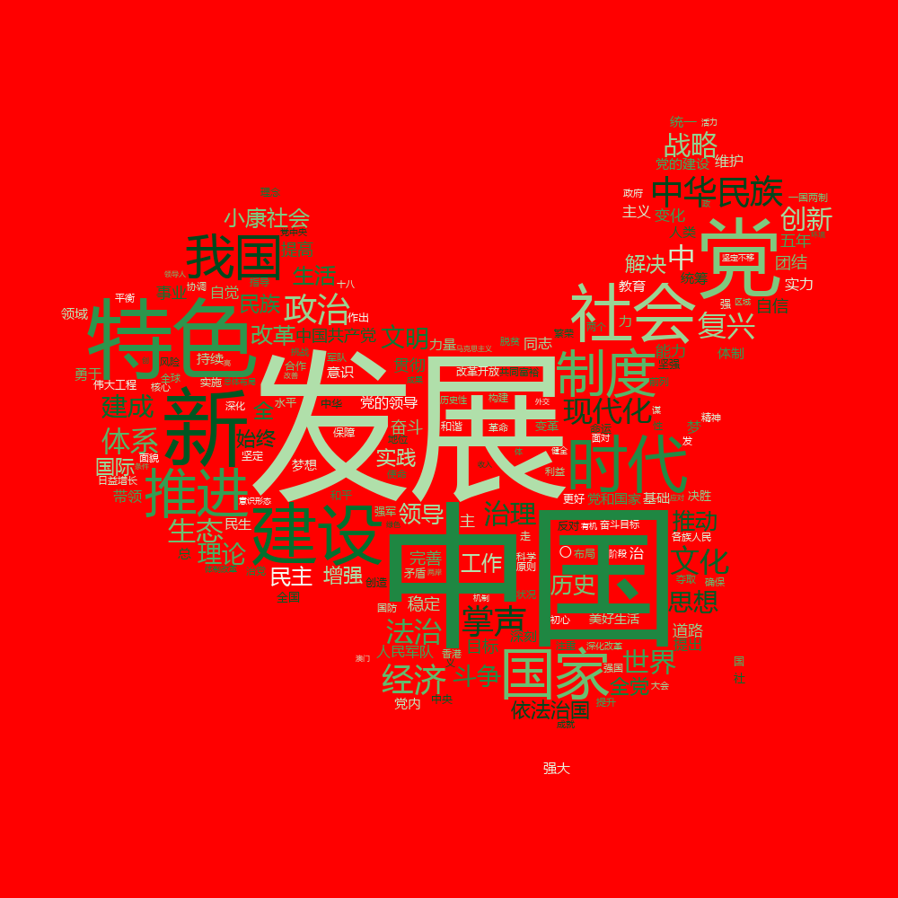
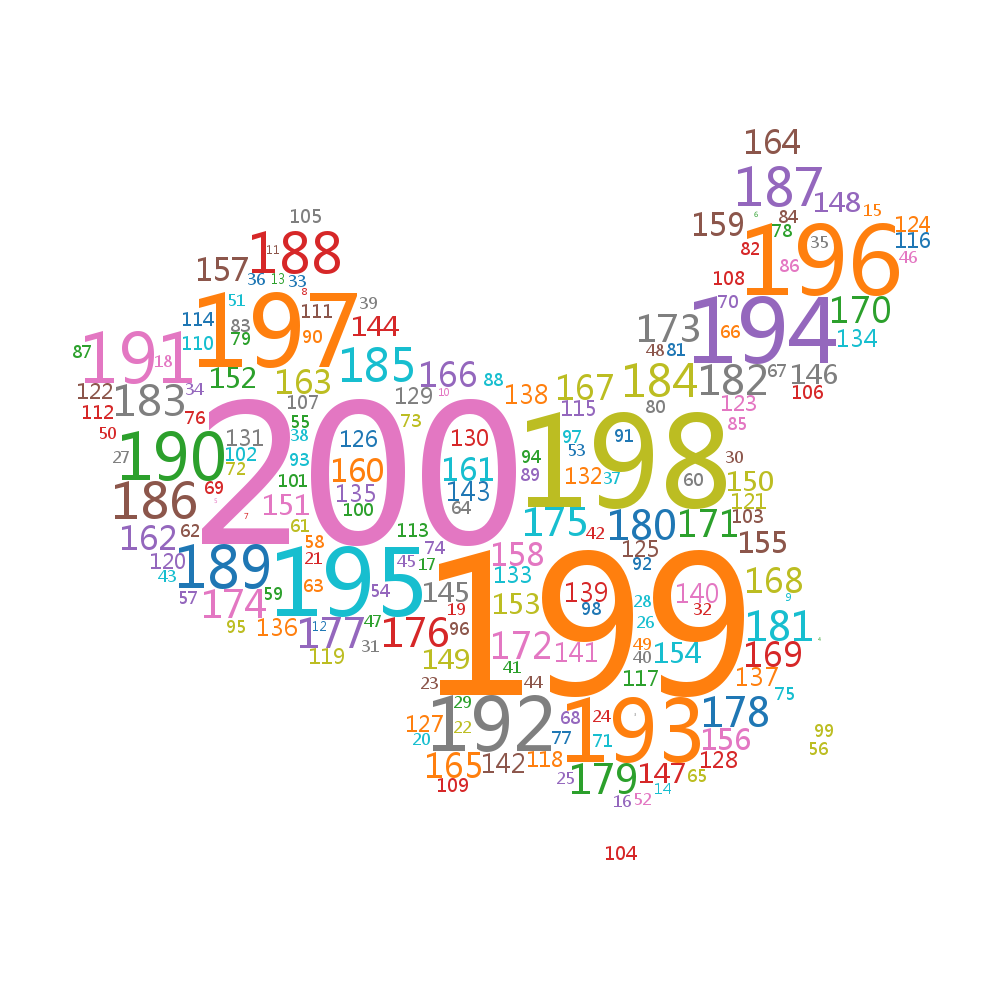

# world-cloud
词云服务

将词云能力封装成服务，以HTTP接口的方式供远程调用。




# 快速启动
**安装依赖库**
```shell
# 开发环境
python --version
Python 3.8.9
#升级pip
pip install --upgrade pip  
# 列出pip所有依赖
pip freeze > requirements.txt
#安装所有依赖
pip install -r requirements.txt
```
**启动**
```shell 
cd src
python app.py
```
然后访问：http://127.0.0.1:8000

## 接口文档
### 生成词云图片接口

- 路由: /api/v1/wordCloud/image
- 协议：HTTP
- 请求方式：POST
- 数据格式：JSON

请求参数：

|     |     |     |     |     |     |
| --- | --- | --- | --- | --- | --- |
| **字段** | **描述** | **类型** | **是否必填** | **备注** | **示例值** |
| font | 字体  | url | 是   | 将字体上传OSS，然后传值URL<br><br>支持格式：OTF 或 TTF | 微软雅黑字体：<br><br>https://haier-btbrrs-public.oss-cn-qingdao.aliyuncs.com/wordcloud/msyh.ttf |
| mask | 蒙版图，背景图 | url | 是   | 将背景图上传OSS，然后传值URL<br><br>支持格式png，图片必须是白色（ #FFFFFF)）背景，图片可以是任意图片，模型会自动识别非白色区域，然后智能渲染 | 中国地图蒙版图：<br><br>https://haier-btbrrs-public.oss-cn-qingdao.aliyuncs.com/wordcloud/bg.png |
| background_color | 背景色 | string | 是   |     | white 或 *black 等等* |
| prefer_horizontal | 水平浮动比 | float | 是   | 尝试水平拟合与垂直拟合的时间比率。如果prefere_horizontal<1，如果不合适，算法将尝试旋转单词。 | 传值浮点数 ，<1自动旋转字体和单词，例如：1.6 |
| width | 画布宽度 | int | 是   | 宽度越大，生成图片耗费的时间越久，不要太大 | 正整数，例如：400 |
| height | 画布高度 | int | 是   | 高度越大，生成图片耗费的时间越久，不要太大 | 正整数，例如：200 |
| colormap | 配色表 | string | 是   | Matplotlib colormap，用于为每个单词随机绘制颜色 | 例如：tab10<br><br>参考文档：https://www.osgeo.cn/matplotlib/tutorials/colors/colormaps.html |
| wordList | 词组  | array | 是   |     |     |

wordList：

|     |     |     |     |     |     |
| --- | --- | --- | --- | --- | --- |
| **字段** | **描述** | **类型** | **是否必填** | **备注** | **示例值** |
| word | 单词  | string | 是   |     | 海尔  |
| count | 次数  | int | 是   | 正整数 | 200 |

请求示例：

这里为了清楚展示，直接使用1-200的数字生成白色背景图

[curl](https://curl.se/)格式直接在终端调用，或者导入 [postman](https://www.postman.com/) 中执行，都可。

```
curl --location --request POST 'http://word-cloud-flask-prod.qd-aliyun-internal2.haier.net/api/v1/wordCloud/image' \
--header 'Content-Type: application/json' \
--data-raw '{
    "font":"https://haier-btbrrs-public.oss-cn-qingdao.aliyuncs.com/wordcloud/msyh.ttf",
    "mask":"https://haier-btbrrs-public.oss-cn-qingdao.aliyuncs.com/wordcloud/bg.png",
    "background_color":"white",
    "prefer_horizontal":1.6,
    "width":400,
    "height":200,
    "colormap":"tab10",
    "wordList": [{"word":200,"count":200},{"word":199,"count":199},{"word":198,"count":198},{"word":197,"count":197},{"word":196,"count":196},{"word":195,"count":195},{"word":194,"count":194},{"word":193,"count":193},{"word":192,"count":192},{"word":191,"count":191},{"word":190,"count":190},{"word":189,"count":189},{"word":188,"count":188},{"word":187,"count":187},{"word":186,"count":186},{"word":185,"count":185},{"word":184,"count":184},{"word":183,"count":183},{"word":182,"count":182},{"word":181,"count":181},{"word":180,"count":180},{"word":179,"count":179},{"word":178,"count":178},{"word":177,"count":177},{"word":176,"count":176},{"word":175,"count":175},{"word":174,"count":174},{"word":173,"count":173},{"word":172,"count":172},{"word":171,"count":171},{"word":170,"count":170},{"word":169,"count":169},{"word":168,"count":168},{"word":167,"count":167},{"word":166,"count":166},{"word":165,"count":165},{"word":164,"count":164},{"word":163,"count":163},{"word":162,"count":162},{"word":161,"count":161},{"word":160,"count":160},{"word":159,"count":159},{"word":158,"count":158},{"word":157,"count":157},{"word":156,"count":156},{"word":155,"count":155},{"word":154,"count":154},{"word":153,"count":153},{"word":152,"count":152},{"word":151,"count":151},{"word":150,"count":150},{"word":149,"count":149},{"word":148,"count":148},{"word":147,"count":147},{"word":146,"count":146},{"word":145,"count":145},{"word":144,"count":144},{"word":143,"count":143},{"word":142,"count":142},{"word":141,"count":141},{"word":140,"count":140},{"word":139,"count":139},{"word":138,"count":138},{"word":137,"count":137},{"word":136,"count":136},{"word":135,"count":135},{"word":134,"count":134},{"word":133,"count":133},{"word":132,"count":132},{"word":131,"count":131},{"word":130,"count":130},{"word":129,"count":129},{"word":128,"count":128},{"word":127,"count":127},{"word":126,"count":126},{"word":125,"count":125},{"word":124,"count":124},{"word":123,"count":123},{"word":122,"count":122},{"word":121,"count":121},{"word":120,"count":120},{"word":119,"count":119},{"word":118,"count":118},{"word":117,"count":117},{"word":116,"count":116},{"word":115,"count":115},{"word":114,"count":114},{"word":113,"count":113},{"word":112,"count":112},{"word":111,"count":111},{"word":110,"count":110},{"word":109,"count":109},{"word":108,"count":108},{"word":107,"count":107},{"word":106,"count":106},{"word":105,"count":105},{"word":104,"count":104},{"word":103,"count":103},{"word":102,"count":102},{"word":101,"count":101},{"word":100,"count":100},{"word":99,"count":99},{"word":98,"count":98},{"word":97,"count":97},{"word":96,"count":96},{"word":95,"count":95},{"word":94,"count":94},{"word":93,"count":93},{"word":92,"count":92},{"word":91,"count":91},{"word":90,"count":90},{"word":89,"count":89},{"word":88,"count":88},{"word":87,"count":87},{"word":86,"count":86},{"word":85,"count":85},{"word":84,"count":84},{"word":83,"count":83},{"word":82,"count":82},{"word":81,"count":81},{"word":80,"count":80},{"word":79,"count":79},{"word":78,"count":78},{"word":77,"count":77},{"word":76,"count":76},{"word":75,"count":75},{"word":74,"count":74},{"word":73,"count":73},{"word":72,"count":72},{"word":71,"count":71},{"word":70,"count":70},{"word":69,"count":69},{"word":68,"count":68},{"word":67,"count":67},{"word":66,"count":66},{"word":65,"count":65},{"word":64,"count":64},{"word":63,"count":63},{"word":62,"count":62},{"word":61,"count":61},{"word":60,"count":60},{"word":59,"count":59},{"word":58,"count":58},{"word":57,"count":57},{"word":56,"count":56},{"word":55,"count":55},{"word":54,"count":54},{"word":53,"count":53},{"word":52,"count":52},{"word":51,"count":51},{"word":50,"count":50},{"word":49,"count":49},{"word":48,"count":48},{"word":47,"count":47},{"word":46,"count":46},{"word":45,"count":45},{"word":44,"count":44},{"word":43,"count":43},{"word":42,"count":42},{"word":41,"count":41},{"word":40,"count":40},{"word":39,"count":39},{"word":38,"count":38},{"word":37,"count":37},{"word":36,"count":36},{"word":35,"count":35},{"word":34,"count":34},{"word":33,"count":33},{"word":32,"count":32},{"word":31,"count":31},{"word":30,"count":30},{"word":29,"count":29},{"word":28,"count":28},{"word":27,"count":27},{"word":26,"count":26},{"word":25,"count":25},{"word":24,"count":24},{"word":23,"count":23},{"word":22,"count":22},{"word":21,"count":21},{"word":20,"count":20},{"word":19,"count":19},{"word":18,"count":18},{"word":17,"count":17},{"word":16,"count":16},{"word":15,"count":15},{"word":14,"count":14},{"word":13,"count":13},{"word":12,"count":12},{"word":11,"count":11},{"word":10,"count":10},{"word":9,"count":9},{"word":8,"count":8},{"word":7,"count":7},{"word":6,"count":6},{"word":5,"count":5},{"word":4,"count":4},{"word":3,"count":3},{"word":2,"count":2},{"word":1,"count":1}]
}'
```

响应图片如下


### 分词接口

- 路由: /api/v1/wordCloud/wordSegmentation
- 协议：HTTP
- 请求方式：POST
- 数据格式：JSON

|     |     |     |     |     |     |
| --- | --- | --- | --- | --- | --- |
| **字段** | **描述** | **类型** | **是否必填** | **备注** | **示例值** |
| text | 内容  | string | 是   | 需要分词的内容，字数越多，分词时长越久 | 十九大全文内容 |
| stopwords | 停用词库 | url | 否   | 停用词库先上传OSS，然后传值URL<br><br>非必填，不传值则返回全量分词 | 通用停用词库：<br><br>https://haier-btbrrs-public.oss-cn-qingdao.aliyuncs.com/wordcloud/stopwords/stopwords.txt |
| top | 按频次取前几个 | int | 否   | 按分词后词语出现的频次自大到小排序后，取前几位<br><br>正整数，非必填，不传值则返回全量分词 | 500 |


请求示例：

这里给“十九大报告全文”分词

```
curl --location --request POST 'http://localhost:8000/api/v1/wordCloud/wordSegmentation' \
--header 'Content-Type: application/json' \
--data-raw '{
    "top": 500,
    "stopwords": "https://haier-btbrrs-public.oss-cn-qingdao.aliyuncs.com/wordcloud/stopwords/stopwords.txt",
    "text": "1\n习近平代表第十八届中央委员会向党的十九大作报告\n【习近平】 同志们： 现在， 我代表第十八届中央委员\n会向大会作报告。\n中国共产党第十九次全国代表大会， 是在全面建成小康\n社会决胜阶段、 中国特色社会主义进入新时代的关键时期召\n开的一次十分重要的大会。\n大会的主题是： 不忘初心， 牢记使命， 高举中国特色社\n会主义伟大旗帜， 决胜全面建成小康社会， 夺取新时代中国\n特色社会主义伟大胜利， 为实现中华民族伟大复兴的中国梦\n不懈奋斗。\n不忘初心， 方得始终。 中国共产党人的初心和使命， 就\n是为中国人民谋幸福， 为中华民族谋复兴。 这个初心和使命\n是激励中国共产党人不断前进的根本动力。 全党同志一定要\n永远与人民同呼吸、 共命运、 心连心， 永远把人民对美好生\n活的向往作为奋斗目标， 以永不懈怠的精神状态和一往无前\n的奋斗姿态， 继续朝着实现中华民族伟大复兴的宏伟目标奋\n勇前进。\n当前， 国内外形势正在发生深刻复杂变化， 我国发展仍\n处于重要战略机遇期， 前景十分光明， 挑战也十分严峻。 全\n党同志一定要登高望远、 居安思危， 勇于变革、 勇于创新，\n永不僵化、 永不停滞， 团结带领全国各族人民决胜全面建成\n小康社会， 奋力夺取新时代中国特色社会主义伟大胜利。\n2\n一、 过去五年的工作和历史性变革\n十八大以来的五年， 是党和国家发展进程中极不平凡的\n五年。 面对世界经济复苏乏力、 局部冲突和动荡频发、 全球\n性问题加剧的外部环境， 面对我国经济发展进入新常态等一\n系列深刻变化， 我们坚持稳中求进工作总基调， 迎难而上，\n开拓进取， 取得了改革开放和社会主义现代化建设的历史性\n成就。\n为贯彻十八大精神， 党中央召开七次全会， 分别就政府\n机构改革和职能转变、 全面深化改革、 全面推进依法治国、\n制定“十三五” 规划、 全面从严治党等重大问题作出决定和\n部署。 五年来， 我们统筹推进“五位一体” 总体布局、 协调\n推进“四个全面” 战略布局， “十二五” 规划胜利完成， “十\n三五” 规划顺利实施， 党和国家事业全面开创新局面。\n经济建设取得重大成就。 坚定不移贯彻新发展理念， 坚\n决端正发展观念、 转变发展方式， 发展质量和效益不断提升。\n经济保持中高速增长， 在世界主要国家中名列前茅， 国内生\n产总值从五十四万亿元增长到八十万亿元， 稳居世界第二，\n对世界经济增长贡献率超过百分之三十。 供给侧结构性改革\n深入推进， 经济结构不断优化， 数字经济等新兴产业蓬勃发\n展， 高铁、 公路、 桥梁、 港口、 机场等基础设施建设快速推\n进。 农业现代化稳步推进， 粮食生产能力达到一万二千亿斤。\n城镇化率年均提高一点二个百分点， 八千多万农业转移人口\n成为城镇居民。 区域发展协调性增强， “一带一路” 建设、\n京津冀协同发展、 长江经济带发展成效显著。 创新驱动发展\n3\n战略大力实施， 创新型国家建设成果丰硕， 天宫、 蛟龙、 天\n眼、 悟空、 墨子、 大飞机等重大科技成果相继问世。 南海岛\n礁建设积极推进。 开放型经济新体制逐步健全， 对外贸易、\n对外投资、 外汇储备稳居世界前列。\n全面深化改革取得重大突破。 蹄疾步稳推进全面深化改\n革， 坚决破除各方面体制机制弊端。 改革全面发力、 多点突\n破、 纵深推进， 着力增强改革系统性、 整体性、 协同性， 压\n茬拓展改革广度和深度， 推出一千五百多项改革举措， 重要\n领域和关键环节改革取得突破性进展， 主要领域改革主体框\n架基本确立。 中国特色社会主义制度更加完善， 国家治理体\n系和治理能力现代化水平明显提高， 全社会发展活力和创新\n活力明显增强。\n民主法治建设迈出重大步伐。 积极发展社会主义民主政\n治， 推进全面依法治国， 党的领导、 人民当家作主、 依法治\n国有机统一的制度建设全面加强， 党的领导体制机制不断完\n善， 社会主义民主不断发展， 党内民主更加广泛， 社会主义\n协商民主全面展开， 爱国统一战线巩固发展， 民族宗教工作\n创新推进。 科学立法、 严格执法、 公正司法、 全民守法深入\n推进， 法治国家、 法治政府、 法治社会建设相互促进， 中国\n特色社会主义法治体系日益完善， 全社会法治观念明显增\n强。 国家监察体制改革试点取得实效， 行政体制改革、 司法\n体制改革、 权力运行制约和监督体系建设有效实施。\n思想文化建设取得重大进展。 加强党对意识形态工作的\n领导， 党的理论创新全面推进， 马克思主义在意识形态领域\n4\n的指导地位更加鲜明， 中国特色社会主义和中国梦深入人\n心， 社会主义核心价值观和中华优秀传统文化广泛弘扬， 群\n众性精神文明创建活动扎实开展。 公共文化服务水平不断提\n高， 文艺创作持续繁荣， 文化事业和文化产业蓬勃发展， 互\n联网建设管理运用不断完善， 全民健身和竞技体育全面发\n展。 主旋律更加响亮， 正能量更加强劲， 文化自信得到彰显，\n国家文化软实力和中华文化影响力大幅提升， 全党全社会思\n想上的团结统一更加巩固。\n人民生活不断改善。 深入贯彻以人民为中心的发展思\n想， 一大批惠民举措落地实施， 人民获得感显著增强。 脱贫\n攻坚战取得决定性进展， 六千多万贫困人口稳定脱贫， 贫困\n发生率从百分之十点二下降到百分之四以下。 教育事业全面\n发展， 中西部和农村教育明显加强。 就业状况持续改善， 城\n镇新增就业年均一千三百万人以上。 城乡居民收入增速超过\n经济增速， 中等收入群体持续扩大。 覆盖城乡居民的社会保\n障体系基本建立， 人民健康和医疗卫生水平大幅提高， 保障\n性住房建设稳步推进。 社会治理体系更加完善， 社会大局保\n持稳定， 国家安全全面加强。\n生态文明建设成效显著。 大力度推进生态文明建设， 全\n党全国贯彻绿色发展理念的自觉性和主动性显著增强， 忽视\n生态环境保护的状况明显改变。 生态文明制度体系加快形\n成， 主体功能区制度逐步健全， 国家公园体制试点积极推进。\n全面节约资源有效推进， 能源资源消耗强度大幅下降。 重大\n生态保护和修复工程进展顺利， 森林覆盖率持续提高。 生态\n5\n环境治理明显加强， 环境状况得到改善。 引导应对气候变化\n国际合作， 成为全球生态文明建设的重要参与者、 贡献者、\n引领者。\n强军兴军开创新局面。 着眼于实现中国梦强军梦， 制定\n新形势下军事战略方针， 全力推进国防和军队现代化。 召开\n古田全军政治工作会议， 恢复和发扬我党我军光荣传统和优\n良作风， 人民军队政治生态得到有效治理。 国防和军队改革\n取得历史性突破， 形成军委管总、 战区主战、 军种主建新格\n局， 人民军队组织架构和力量体系实现革命性重塑。 加强练\n兵备战， 有效遂行海上维权、 反恐维稳、 抢险救灾、 国际维\n和、 亚丁湾护航、 人道主义救援等重大任务， 武器装备加快\n发展， 军事斗争准备取得重大进展。 人民军队在中国特色强\n军之路上迈出坚定步伐。\n港澳台工作取得新进展。 全面准确贯彻“一国两制” 方\n针， 牢牢掌握宪法和基本法赋予的中央对香港、 澳门全面管\n治权， 深化内地和港澳地区交流合作， 保持香港、 澳门繁荣\n稳定。 坚持一个中国原则和“九二共识” ， 推动两岸关系和\n平发展， 加强两岸经济文化交流合作， 实现两岸领导人历史\n性会晤。 妥善应对台湾局势变化， 坚决反对和遏制“台独”\n分裂势力， 有力维护台海和平稳定。\n全方位外交布局深入展开。 全面推进中国特色大国外\n交， 形成全方位、 多层次、 立体化的外交布局， 为我国发展\n营造了良好外部条件。 实施共建“一带一路” 倡议， 发起创\n办亚洲基础设施投资银行， 设立丝路基金， 举办首届“一带\n6\n一路”国际合作高峰论坛、 亚太经合组织领导人非正式会议、\n二十国集团领导人杭州峰会、 金砖国家领导人厦门会晤、 亚\n信峰会。 倡导构建人类命运共同体， 促进全球治理体系变革。\n我国国际影响力、 感召力、 塑造力进一步提高， 为世界和平\n与发展作出新的重大贡献。\n全面从严治党成效卓著。 全面加强党的领导和党的建\n设， 坚决改变管党治党宽松软状况。 推动全党尊崇党章， 增\n强政治意识、 大局意识、 核心意识、 看齐意识， 坚决维护党\n中央权威和集中统一领导， 严明党的政治纪律和政治规矩，\n层层落实管党治党政治责任。 坚持照镜子、 正衣冠、 洗洗澡、\n治治病的要求， 开展党的群众路线教育实践活动和“三严三\n实” 专题教育， 推进“两学一做” 学习教育常态化制度化，\n全党理想信念更加坚定、 党性更加坚强。 贯彻新时期好干部\n标准， 选人用人状况和风气明显好转。 党的建设制度改革深\n入推进， 党内法规制度体系不断完善。 把纪律挺在前面， 着\n力解决人民群众反映最强烈、 对党的执政基础威胁最大的突\n出问题。 出台中央八项规定， 严厉整治形式主义、 官僚主义、\n享乐主义和奢靡之风， 坚决反对特权。 巡视利剑作用彰显，\n实现中央和省级党委巡视全覆盖。 坚持反腐败无禁区、 全覆\n盖、 零容忍， 坚定不移“打虎” 、 “拍蝇” 、 “猎狐” ， 不\n敢腐的目标初步实现， 不能腐的笼子越扎越牢， 不想腐的堤\n坝正在构筑， 反腐败斗争压倒性态势已经形成并巩固发展。\n（ 掌声）\n五年来的成就是全方位的、 开创性的， 五年来的变革是\n7\n深层次的、 根本性的。 五年来， 我们党以巨大的政治勇气和\n强烈的责任担当， 提出一系列新理念新思想新战略， 出台一\n系列重大方针政策， 推出一系列重大举措， 推进一系列重大\n工作， 解决了许多长期想解决而没有解决的难题， 办成了许\n多过去想办而没有办成的大事， 推动党和国家事业发生历史\n性变革。 这些历史性变革， 对党和国家事业发展具有重大而\n深远的影响。\n五年来， 我们勇于面对党面临的重大风险考验和党内存\n在的突出问题， 以顽强意志品质正风肃纪、 反腐惩恶， 消除\n了党和国家内部存在的严重隐患， 党内政治生活气象更新，\n党内政治生态明显好转， 党的创造力、 凝聚力、 战斗力显著\n增强， 党的团结统一更加巩固， 党群关系明显改善， 党在革\n命性锻造中更加坚强， 焕发出新的强大生机活力， 为党和国\n家事业发展提供了坚强政治保证。 （ 掌声）\n同时， 必须清醒看到， 我们的工作还存在许多不足， 也\n面临不少困难和挑战。 主要是： 发展不平衡不充分的一些突\n出问题尚未解决， 发展质量和效益还不高， 创新能力不够强，\n实体经济水平有待提高， 生态环境保护任重道远； 民生领域\n还有不少短板， 脱贫攻坚任务艰巨， 城乡区域发展和收入分\n配差距依然较大， 群众在就业、 教育、 医疗、 居住、 养老等\n方面面临不少难题； 社会文明水平尚需提高； 社会矛盾和问\n题交织叠加， 全面依法治国任务依然繁重， 国家治理体系和\n治理能力有待加强； 意识形态领域斗争依然复杂， 国家安全\n面临新情况； 一些改革部署和重大政策措施需要进一步落\n8\n实； 党的建设方面还存在不少薄弱环节。 这些问题， 必须着\n力加以解决。\n五年来的成就， 是党中央坚强领导的结果， 更是全党全\n国各族人民共同奋斗的结果。 我代表中共中央， 向全国各族\n人民， 向各民主党派、 各人民团体和各界爱国人士， 向香港\n特别行政区同胞、 澳门特别行政区同胞和台湾同胞以及广大\n侨胞， 向关心和支持中国现代化建设的各国朋友， 表示衷心\n的感谢！ （ 掌声）\n同志们！ 改革开放之初， 我们党发出了走自己的路、 建\n设中国特色社会主义的伟大号召。 从那时以来， 我们党团结\n带领全国各族人民不懈奋斗， 推动我国经济实力、 科技实力、\n国防实力、 综合国力进入世界前列， 推动我国国际地位实现\n前所未有的提升， 党的面貌、 国家的面貌、 人民的面貌、 军\n队的面貌、 中华民族的面貌发生了前所未有的变化， 中华民\n族正以崭新姿态屹立于世界的东方。 （ 掌声）\n经过长期努力， 中国特色社会主义进入了新时代， 这是\n我国发展新的历史方位。\n中国特色社会主义进入新时代， 意味着近代以来久经磨\n难的中华民族迎来了从站起来、 富起来到强起来的伟大飞\n跃， 迎来了实现中华民族伟大复兴的光明前景； 意味着科学\n社会主义在二十一世纪的中国焕发出强大生机活力， 在世界\n上高高举起了中国特色社会主义伟大旗帜； 意味着中国特色\n社会主义道路、 理论、 制度、 文化不断发展， 拓展了发展中\n国家走向现代化的途径， 给世界上那些既希望加快发展又希\n9\n望保持自身独立性的国家和民族提供了全新选择， 为解决人\n类问题贡献了中国智慧和中国方案。 （ 掌声）\n这个新时代， 是承前启后、 继往开来、 在新的历史条件\n下继续夺取中国特色社会主义伟大胜利的时代， 是决胜全面\n建成小康社会、 进而全面建设社会主义现代化强国的时代，\n是全国各族人民团结奋斗、 不断创造美好生活、 逐步实现全\n体人民共同富裕的时代， 是全体中华儿女勠力同心、 奋力实\n现中华民族伟大复兴中国梦的时代， 是我国日益走近世界舞\n台中央、 不断为人类作出更大贡献的时代。\n中国特色社会主义进入新时代， 我国社会主要矛盾已经\n转化为人民日益增长的美好生活需要和不平衡不充分的发\n展之间的矛盾。 我国稳定解决了十几亿人的温饱问题， 总体\n上实现小康， 不久将全面建成小康社会， 人民美好生活需要\n日益广泛， 不仅对物质文化生活提出了更高要求， 而且在民\n主、 法治、 公平、 正义、 安全、 环境等方面的要求日益增长。\n同时， 我国社会生产力水平总体上显著提高， 社会生产能力\n在很多方面进入世界前列， 更加突出的问题是发展不平衡不\n充分， 这已经成为满足人民日益增长的美好生活需要的主要\n制约因素。\n必须认识到， 我国社会主要矛盾的变化是关系全局的历\n史性变化， 对党和国家工作提出了许多新要求。 我们要在继\n续推动发展的基础上， 着力解决好发展不平衡不充分问题，\n大力提升发展质量和效益， 更好满足人民在经济、 政治、 文\n化、 社会、 生态等方面日益增长的需要， 更好推动人的全面\n10\n发展、 社会全面进步。\n同志们！ 中国特色社会主义进入新时代， 在中华人民共\n和国发展史上、 中华民族发展史上具有重大意义， 在世界社\n会主义发展史上、 人类社会发展史上也具有重大意义。 全党\n要坚定信心、 奋发有为， 让中国特色社会主义展现出更加强\n大的生命力！ (掌声)\n二、 新时代中国共产党的历史使命\n一百年前， 十月革命一声炮响， 给中国送来了马克思列\n宁主义。 中国先进分子从马克思列宁主义的科学真理中看到\n了解决中国问题的出路。 在近代以后中国社会的剧烈运动\n中， 在中国人民反抗封建统治和外来侵略的激烈斗争中， 在\n马克思列宁主义同中国工人运动的结合过程中， 一九二一年\n中国共产党应运而生。 从此， 中国人民谋求民族独立、 人民\n解放和国家富强、 人民幸福的斗争就有了主心骨， 中国人民\n就从精神上由被动转为主动。\n中华民族有五千多年的文明历史， 创造了灿烂的中华文\n明， 为人类作出了卓越贡献， 成为世界上伟大的民族。 鸦片\n战争后， 中国陷入内忧外患的黑暗境地， 中国人民经历了战\n乱频仍、 山河破碎、 民不聊生的深重苦难。 为了民族复兴，\n无数仁人志士不屈不挠、 前仆后继， 进行了可歌可泣的斗争，\n进行了各式各样的尝试， 但终究未能改变旧中国的社会性质\n和中国人民的悲惨命运。\n实现中华民族伟大复兴是近代以来中华民族最伟大的\n梦想。 中国共产党一经成立， 就把实现共产主义作为党的最\n11\n高理想和最终目标， 义无反顾肩负起实现中华民族伟大复兴\n的历史使命， 团结带领人民进行了艰苦卓绝的斗争， 谱写了\n气吞山河的壮丽史诗。\n我们党深刻认识到， 实现中华民族伟大复兴， 必须推翻\n压在中国人民头上的帝国主义、 封建主义、 官僚资本主义三\n座大山， 实现民族独立、 人民解放、 国家统一、 社会稳定。\n我们党团结带领人民找到了一条以农村包围城市、 武装夺取\n政权的正确革命道路， 进行了二十八年浴血奋战， 完成了新\n民主主义革命， 一九四九年建立了中华人民共和国， 实现了\n中国从几千年封建专制政治向人民民主的伟大飞跃。\n我们党深刻认识到， 实现中华民族伟大复兴， 必须建立\n符合我国实际的先进社会制度。 我们党团结带领人民完成社\n会主义革命， 确立社会主义基本制度， 推进社会主义建设，\n完成了中华民族有史以来最为广泛而深刻的社会变革， 为当\n代中国一切发展进步奠定了根本政治前提和制度基础， 实现\n了中华民族由近代不断衰落到根本扭转命运、 持续走向繁荣\n富强的伟大飞跃。\n我们党深刻认识到， 实现中华民族伟大复兴， 必须合乎\n时代潮流、 顺应人民意愿， 勇于改革开放， 让党和人民事业\n始终充满奋勇前进的强大动力。 我们党团结带领人民进行改\n革开放新的伟大革命， 破除阻碍国家和民族发展的一切思想\n和体制障碍， 开辟了中国特色社会主义道路， 使中国大踏步\n赶上时代。\n九十六年来， 为了实现中华民族伟大复兴的历史使命，\n12\n无论是弱小还是强大， 无论是顺境还是逆境， 我们党都初心\n不改、 矢志不渝， 团结带领人民历经千难万险， 付出巨大牺\n牲， 敢于面对曲折， 勇于修正错误， 攻克了一个又一个看似\n不可攻克的难关， 创造了一个又一个彪炳史册的人间奇迹。\n(掌声)\n同志们！ 今天， 我们比历史上任何时期都更接近、 更有\n信心和能力实现中华民族伟大复兴的目标。 (掌声)\n行百里者半九十。 中华民族伟大复兴， 绝不是轻轻松松、\n敲锣打鼓就能实现的。 全党必须准备付出更为艰巨、 更为艰\n苦的努力。\n实现伟大梦想， 必须进行伟大斗争。 社会是在矛盾运动\n中前进的， 有矛盾就会有斗争。 我们党要团结带领人民有效\n应对重大挑战、 抵御重大风险、 克服重大阻力、 解决重大矛\n盾， 必须进行具有许多新的历史特点的伟大斗争， 任何贪图\n享受、 消极懈怠、 回避矛盾的思想和行为都是错误的。 全党\n要更加自觉地坚持党的领导和我国社会主义制度， 坚决反对\n一切削弱、 歪曲、 否定党的领导和我国社会主义制度的言行；\n更加自觉地维护人民利益， 坚决反对一切损害人民利益、 脱\n离群众的行为； 更加自觉地投身改革创新时代潮流， 坚决破\n除一切顽瘴痼疾； 更加自觉地维护我国主权、 安全、 发展利\n益， 坚决反对一切分裂祖国、 破坏民族团结和社会和谐稳定\n的行为； 更加自觉地防范各种风险， 坚决战胜一切在政治、\n经济、 文化、 社会等领域和自然界出现的困难和挑战。 全党\n要充分认识这场伟大斗争的长期性、 复杂性、 艰巨性， 发扬\n13\n斗争精神， 提高斗争本领， 不断夺取伟大斗争新胜利。\n实现伟大梦想， 必须建设伟大工程。 这个伟大工程就是\n我们党正在深入推进的党的建设新的伟大工程。 历史已经并\n将继续证明， 没有中国共产党的领导， 民族复兴必然是空想。\n我们党要始终成为时代先锋、 民族脊梁， 始终成为马克思主\n义执政党， 自身必须始终过硬。 全党要更加自觉地坚定党性\n原则， 勇于直面问题， 敢于刮骨疗毒， 消除一切损害党的先\n进性和纯洁性的因素， 清除一切侵蚀党的健康肌体的病毒，\n不断增强党的政治领导力、 思想引领力、 群众组织力、 社会\n号召力， 确保我们党永葆旺盛生命力和强大战斗力。（ 掌声）\n实现伟大梦想， 必须推进伟大事业。 中国特色社会主义\n是改革开放以来党的全部理论和实践的主题， 是党和人民历\n尽千辛万苦、 付出巨大代价取得的根本成就。 中国特色社会\n主义道路是实现社会主义现代化、 创造人民美好生活的必由\n之路， 中国特色社会主义理论体系是指导党和人民实现中华\n民族伟大复兴的正确理论， 中国特色社会主义制度是当代中\n国发展进步的根本制度保障， 中国特色社会主义文化是激励\n全党全国各族人民奋勇前进的强大精神力量。 全党要更加自\n觉地增强道路自信、 理论自信、 制度自信、 文化自信， 既不\n走封闭僵化的老路， 也不走改旗易帜的邪路， 保持政治定力，\n坚持实干兴邦， 始终坚持和发展中国特色社会主义。\n伟大斗争， 伟大工程， 伟大事业， 伟大梦想， 紧密联系、\n相互贯通、 相互作用， 其中起决定性作用的是党的建设新的\n伟大工程。 推进伟大工程， 要结合伟大斗争、 伟大事业、 伟\n14\n大梦想的实践来进行， 确保党在世界形势深刻变化的历史进\n程中始终走在时代前列， 在应对国内外各种风险和考验的历\n史进程中始终成为全国人民的主心骨， 在坚持和发展中国特\n色社会主义的历史进程中始终成为坚强领导核心。\n同志们！ 使命呼唤担当， 使命引领未来。 我们要不负人\n民重托、 无愧历史选择， 在新时代中国特色社会主义的伟大\n实践中， 以党的坚强领导和顽强奋斗， 激励全体中华儿女不\n断奋进， 凝聚起同心共筑中国梦的磅礴力量！ （ 掌声）\n三、 新时代中国特色社会主义思想和基本方略\n十八大以来， 国内外形势变化和我国各项事业发展都给\n我们提出了一个重大时代课题， 这就是必须从理论和实践结\n合上系统回答新时代坚持和发展什么样的中国特色社会主\n义、 怎样坚持和发展中国特色社会主义， 包括新时代坚持和\n发展中国特色社会主义的总目标、 总任务、 总体布局、 战略\n布局和发展方向、 发展方式、 发展动力、 战略步骤、 外部条\n件、 政治保证等基本问题， 并且要根据新的实践对经济、 政\n治、 法治、 科技、 文化、 教育、 民生、 民族、 宗教、 社会、\n生态文明、 国家安全、 国防和军队、 “一国两制” 和祖国统\n一、 统一战线、 外交、 党的建设等各方面作出理论分析和政\n策指导， 以利于更好坚持和发展中国特色社会主义。\n围绕这个重大时代课题， 我们党坚持以马克思列宁主\n义、 毛泽东思想、 邓小平理论、 “三个代表” 重要思想、 科\n学发展观为指导， 坚持解放思想、 实事求是、 与时俱进、 求\n真务实， 坚持辩证唯物主义和历史唯物主义， 紧密结合新的\n15\n时代条件和实践要求， 以全新的视野深化对共产党执政规\n律、 社会主义建设规律、 人类社会发展规律的认识， 进行艰\n辛理论探索， 取得重大理论创新成果， 形成了新时代中国特\n色社会主义思想。 （ 掌声）\n新时代中国特色社会主义思想， 明确坚持和发展中国特\n色社会主义， 总任务是实现社会主义现代化和中华民族伟大\n复兴， 在全面建成小康社会的基础上， 分两步走在本世纪中\n叶建成富强民主文明和谐美丽的社会主义现代化强国； 明确\n新时代我国社会主要矛盾是人民日益增长的美好生活需要\n和不平衡不充分的发展之间的矛盾， 必须坚持以人民为中心\n的发展思想， 不断促进人的全面发展、 全体人民共同富裕；\n明确中国特色社会主义事业总体布局是“五位一体” 、 战略\n布局是“四个全面” ， 强调坚定道路自信、 理论自信、 制度\n自信、 文化自信； 明确全面深化改革总目标是完善和发展中\n国特色社会主义制度、 推进国家治理体系和治理能力现代\n化； 明确全面推进依法治国总目标是建设中国特色社会主义\n法治体系、 建设社会主义法治国家； 明确党在新时代的强军\n目标是建设一支听党指挥、 能打胜仗、 作风优良的人民军队，\n把人民军队建设成为世界一流军队； 明确中国特色大国外交\n要推动构建新型国际关系， 推动构建人类命运共同体； 明确\n中国特色社会主义最本质的特征是中国共产党领导， 中国特\n色社会主义制度的最大优势是中国共产党领导， 党是最高政\n治领导力量， 提出新时代党的建设总要求， 突出政治建设在\n党的建设中的重要地位。\n16\n新时代中国特色社会主义思想， 是对马克思列宁主义、\n毛泽东思想、 邓小平理论、 “三个代表” 重要思想、 科学发\n展观的继承和发展， 是马克思主义中国化最新成果， 是党和\n人民实践经验和集体智慧的结晶， 是中国特色社会主义理论\n体系的重要组成部分， 是全党全国人民为实现中华民族伟大\n复兴而奋斗的行动指南， 必须长期坚持并不断发展。 全党要\n深刻领会新时代中国特色社会主义思想的精神实质和丰富\n内涵， 在各项工作中全面准确贯彻落实。\n（ 一） 坚持党对一切工作的领导。 党政军民学， 东西南\n北中， 党是领导一切的。 必须增强政治意识、 大局意识、 核\n心意识、 看齐意识， 自觉维护党中央权威和集中统一领导，\n自觉在思想上政治上行动上同党中央保持高度一致， 完善坚\n持党的领导的体制机制， 坚持稳中求进工作总基调， 统筹推\n进“ 五位一体” 总体布局， 协调推进“四个全面” 战略布局，\n提高党把方向、 谋大局、 定政策、 促改革的能力和定力， 确\n保党始终总揽全局、 协调各方。\n（ 二） 坚持以人民为中心。 人民是历史的创造者， 是决\n定党和国家前途命运的根本力量。 必须坚持人民主体地位，\n坚持立党为公、 执政为民， 践行全心全意为人民服务的根本\n宗旨， 把党的群众路线贯彻到治国理政全部活动之中， 把人\n民对美好生活的向往作为奋斗目标， 依靠人民创造历史伟\n业。 （ 掌声）\n（ 三） 坚持全面深化改革。 只有社会主义才能救中国，\n只有改革开放才能发展中国、 发展社会主义、 发展马克思主\n17\n义。 必须坚持和完善中国特色社会主义制度， 不断推进国家\n治理体系和治理能力现代化， 坚决破除一切不合时宜的思想\n观念和体制机制弊端， 突破利益固化的藩篱， 吸收人类文明\n有益成果， 构建系统完备、 科学规范、 运行有效的制度体系，\n充分发挥我国社会主义制度优越性。\n（ 四） 坚持新发展理念。 发展是解决我国一切问题的基\n础和关键， 发展必须是科学发展， 必须坚定不移贯彻创新、\n协调、 绿色、 开放、 共享的发展理念。 必须坚持和完善我国\n社会主义基本经济制度和分配制度， 毫不动摇巩固和发展公\n有制经济， 毫不动摇鼓励、 支持、 引导非公有制经济发展，\n使市场在资源配置中起决定性作用， 更好发挥政府作用， 推\n动新型工业化、 信息化、 城镇化、 农业现代化同步发展， 主\n动参与和推动经济全球化进程， 发展更高层次的开放型经\n济， 不断壮大我国经济实力和综合国力。\n（ 五） 坚持人民当家作主。 坚持党的领导、 人民当家作\n主、 依法治国有机统一是社会主义政治发展的必然要求。 必\n须坚持中国特色社会主义政治发展道路， 坚持和完善人民代\n表大会制度、 中国共产党领导的多党合作和政治协商制度、\n民族区域自治制度、 基层群众自治制度， 巩固和发展最广泛\n的爱国统一战线， 发展社会主义协商民主， 健全民主制度，\n丰富民主形式， 拓宽民主渠道， 保证人民当家作主落实到国\n家政治生活和社会生活之中。\n（ 六） 坚持全面依法治国。 全面依法治国是中国特色社\n会主义的本质要求和重要保障。 必须把党的领导贯彻落实到\n18\n依法治国全过程和各方面， 坚定不移走中国特色社会主义法\n治道路， 完善以宪法为核心的中国特色社会主义法律体系，\n建设中国特色社会主义法治体系， 建设社会主义法治国家，\n发展中国特色社会主义法治理论， 坚持依法治国、 依法执政、\n依法行政共同推进， 坚持法治国家、 法治政府、 法治社会一\n体建设， 坚持依法治国和以德治国相结合， 依法治国和依规\n治党有机统一， 深化司法体制改革， 提高全民族法治素养和\n道德素质。\n（ 七） 坚持社会主义核心价值体系。 文化自信是一个国\n家、 一个民族发展中更基本、 更深沉、 更持久的力量。 必须\n坚持马克思主义， 牢固树立共产主义远大理想和中国特色社\n会主义共同理想， 培育和践行社会主义核心价值观， 不断增\n强意识形态领域主导权和话语权， 推动中华优秀传统文化创\n造性转化、 创新性发展， 继承革命文化， 发展社会主义先进\n文化， 不忘本来、 吸收外来、 面向未来， 更好构筑中国精神、\n中国价值、 中国力量， 为人民提供精神指引。\n（ 八） 坚持在发展中保障和改善民生。 增进民生福祉是\n发展的根本目的。 必须多谋民生之利、 多解民生之忧， 在发\n展中补齐民生短板、 促进社会公平正义， 在幼有所育、 学有\n所教、 劳有所得、 病有所医、 老有所养、 住有所居、 弱有所\n扶上不断取得新进展， 深入开展脱贫攻坚， 保证全体人民在\n共建共享发展中有更多获得感， 不断促进人的全面发展、 全\n体人民共同富裕。 建设平安中国， 加强和创新社会治理， 维\n护社会和谐稳定， 确保国家长治久安、 人民安居乐业。 （ 掌\n19\n声）\n（ 九） 坚持人与自然和谐共生。 建设生态文明是中华民\n族永续发展的千年大计。 必须树立和践行绿水青山就是金山\n银山的理念， 坚持节约资源和保护环境的基本国策， 像对待\n生命一样对待生态环境， 统筹山水林田湖草系统治理， 实行\n最严格的生态环境保护制度， 形成绿色发展方式和生活方\n式， 坚定走生产发展、 生活富裕、 生态良好的文明发展道路，\n建设美丽中国， 为人民创造良好生产生活环境， 为全球生态\n安全作出贡献。 （ 掌声）\n（ 十） 坚持总体国家安全观。 统筹发展和安全， 增强忧\n患意识， 做到居安思危， 是我们党治国理政的一个重大原则。\n必须坚持国家利益至上， 以人民安全为宗旨， 以政治安全为\n根本， 统筹外部安全和内部安全、 国土安全和国民安全、 传\n统安全和非传统安全、 自身安全和共同安全， 完善国家安全\n制度体系， 加强国家安全能力建设， 坚决维护国家主权、 安\n全、 发展利益。\n（ 十一） 坚持党对人民军队的绝对领导。 建设一支听党\n指挥、 能打胜仗、 作风优良的人民军队， 是实现“两个一百\n年” 奋斗目标、 实现中华民族伟大复兴的战略支撑。 必须全\n面贯彻党领导人民军队的一系列根本原则和制度， 确立新时\n代党的强军思想在国防和军队建设中的指导地位， 坚持政治\n建军、 改革强军、 科技兴军、 依法治军， 更加注重聚焦实战，\n更加注重创新驱动， 更加注重体系建设， 更加注重集约高效，\n更加注重军民融合， 实现党在新时代的强军目标。 （ 掌声）\n20\n（十二） 坚持“一国两制”和推进祖国统一。 保持香港、\n澳门长期繁荣稳定， 实现祖国完全统一， 是实现中华民族伟\n大复兴的必然要求。 必须把维护中央对香港、 澳门特别行政\n区全面管治权和保障特别行政区高度自治权有机结合起来，\n确保“一国两制” 方针不会变、 不动摇， 确保“一国两制”\n实践不变形、 不走样。 必须坚持一个中国原则， 坚持“九二\n共识” ， 推动两岸关系和平发展， 深化两岸经济合作和文化\n往来， 推动两岸同胞共同反对一切分裂国家的活动， 共同为\n实现中华民族伟大复兴而奋斗。 （掌声）\n（十三） 坚持推动构建人类命运共同体。 中国人民的梦\n想同各国人民的梦想息息相通， 实现中国梦离不开和平的国\n际环境和稳定的国际秩序。 必须统筹国内国际两个大局， 始\n终不渝走和平发展道路、 奉行互利共赢的开放战略， 坚持正\n确义利观， 树立共同、 综合、 合作、 可持续的新安全观， 谋\n求开放创新、 包容互惠的发展前景， 促进和而不同、 兼收并\n蓄的文明交流， 构筑尊崇自然、 绿色发展的生态体系， 始终\n做世界和平的建设者、 全球发展的贡献者、 国际秩序的维护\n者。\n（十四） 坚持全面从严治党。 勇于自我革命， 从严管党\n治党， 是我们党最鲜明的品格。 必须以党章为根本遵循， 把\n党的政治建设摆在首位， 思想建党和制度治党同向发力， 统\n筹推进党的各项建设， 抓住“关键少数”， 坚持“三严三实”，\n坚持民主集中制， 严肃党内政治生活， 严明党的纪律， 强化\n党内监督， 发展积极健康的党内政治文化， 全面净化党内政\n21\n治生态， 坚决纠正各种不正之风， 以零容忍态度惩治腐败，\n不断增强党自我净化、 自我完善、 自我革新、 自我提高的能\n力， 始终保持党同人民群众的血肉联系。 （ 掌声）\n以上十四条， 构成新时代坚持和发展中国特色社会主义\n的基本方略。 全党同志必须全面贯彻党的基本理论、 基本路\n线、 基本方略， 更好引领党和人民事业发展。\n实践没有止境， 理论创新也没有止境。 世界每时每刻都\n在发生变化， 中国也每时每刻都在发生变化， 我们必须在理\n论上跟上时代， 不断认识规律， 不断推进理论创新、 实践创\n新、 制度创新、 文化创新以及其他各方面创新。\n同志们！ 时代是思想之母， 实践是理论之源。 只要我们\n善于聆听时代声音， 勇于坚持真理、 修正错误， 二十一世纪\n中国的马克思主义一定能够展现出更强大、 更有说服力的真\n理力量！ （ 掌声）\n四、 决胜全面建成小康社会， 开启全面建设社会主义现\n代化国家新征程\n改革开放之后， 我们党对我国社会主义现代化建设作出\n战略安排， 提出“三步走” 战略目标。 解决人民温饱问题、\n人民生活总体上达到小康水平这两个目标已提前实现。 在这\n个基础上， 我们党提出， 到建党一百年时建成经济更加发展、\n民主更加健全、 科教更加进步、 文化更加繁荣、 社会更加和\n谐、 人民生活更加殷实的小康社会， 然后再奋斗三十年， 到\n新中国成立一百年时， 基本实现现代化， 把我国建成社会主\n义现代化国家。 （ 掌声）\n22\n从现在到二〇二〇年， 是全面建成小康社会决胜期。 要\n按照十六大、 十七大、 十八大提出的全面建成小康社会各项\n要求， 紧扣我国社会主要矛盾变化， 统筹推进经济建设、 政\n治建设、 文化建设、 社会建设、 生态文明建设， 坚定实施科\n教兴国战略、 人才强国战略、 创新驱动发展战略、 乡村振兴\n战略、 区域协调发展战略、 可持续发展战略、 军民融合发展\n战略， 突出抓重点、 补短板、 强弱项， 特别是要坚决打好防\n范化解重大风险、 精准脱贫、 污染防治的攻坚战， 使全面建\n成小康社会得到人民认可、 经得起历史检验。 （ 掌声）\n从十九大到二十大， 是“两个一百年” 奋斗目标的历史\n交汇期。 我们既要全面建成小康社会、 实现第一个百年奋斗\n目标， 又要乘势而上开启全面建设社会主义现代化国家新征\n程， 向第二个百年奋斗目标进军。\n综合分析国际国内形势和我国发展条件， 从二〇二〇年\n到本世纪中叶可以分两个阶段来安排。\n第一个阶段， 从二〇二〇年到二〇三五年， 在全面建成\n小康社会的基础上， 再奋斗十五年， 基本实现社会主义现代\n化。 到那时， 我国经济实力、 科技实力将大幅跃升， 跻身创\n新型国家前列； 人民平等参与、 平等发展权利得到充分保障，\n法治国家、 法治政府、 法治社会基本建成， 各方面制度更加\n完善， 国家治理体系和治理能力现代化基本实现； 社会文明\n程度达到新的高度， 国家文化软实力显著增强， 中华文化影\n响更加广泛深入； 人民生活更为宽裕， 中等收入群体比例明\n显提高， 城乡区域发展差距和居民生活水平差距显著缩小，\n23\n基本公共服务均等化基本实现， 全体人民共同富裕迈出坚实\n步伐； 现代社会治理格局基本形成， 社会充满活力又和谐有\n序； 生态环境根本好转， 美丽中国目标基本实现。 （ 掌声）\n第二个阶段， 从二〇三五年到本世纪中叶， 在基本实现\n现代化的基础上， 再奋斗十五年， 把我国建成富强民主文明\n和谐美丽的社会主义现代化强国。 到那时， 我国物质文明、\n政治文明、 精神文明、 社会文明、 生态文明将全面提升， 实\n现国家治理体系和治理能力现代化， 成为综合国力和国际影\n响力领先的国家， 全体人民共同富裕基本实现， 我国人民将\n享有更加幸福安康的生活， 中华民族将以更加昂扬的姿态屹\n立于世界民族之林。 （ 掌声， 持久掌声）\n同志们！ 从全面建成小康社会到基本实现现代化， 再到\n全面建成社会主义现代化强国， 是新时代中国特色社会主义\n发展的战略安排。 我们要坚忍不拔、 锲而不舍， 奋力谱写社\n会主义现代化新征程的壮丽篇章！ （ 掌声， 持久掌声）\n"
}'
```

返回示例：

```
[{"count":105,"word":"发展"},{"count":94,"word":"中国"},{"count":50,"word":"特色"},{"count":49,"word":"党"},{"count":49,"word":"新"},{"count":46,"word":"建设"},{"count":43,"word":"社会"},{"count":39,"word":"时代"},{"count":38,"word":"国家"},{"count":34,"word":"推进"},{"count":32,"word":"制度"},{"count":30,"word":"我国"},{"count":26,"word":"中华民族"},{"count":26,"word":"政治"},{"count":24,"word":"经济"},{"count":24,"word":"掌声"},{"count":23,"word":"现代化"},{"count":23,"word":"文化"},{"count":21,"word":"复兴"},{"count":21,"word":"体系"},{"count":20,"word":"中"},{"count":20,"word":"法治"},{"count":20,"word":"生态"},{"count":19,"word":"战略"},{"count":19,"word":"世界"},{"count":18,"word":"建成"},{"count":18,"word":"创新"},{"count":18,"word":"治理"},{"count":17,"word":"思想"},{"count":16,"word":"理论"},{"count":16,"word":"文明"},{"count":16,"word":"斗争"},{"count":14,"word":"改革"},{"count":14,"word":"领导"},{"count":14,"word":"推动"},{"count":14,"word":"历史"},{"count":13,"word":"小康社会"},{"count":13,"word":"民主"},{"count":13,"word":"生活"},{"count":12,"word":"全"},{"count":12,"word":"工作"},{"count":12,"word":"解决"},{"count":12,"word":"民族"},{"count":11,"word":"始终"},{"count":11,"word":"依法治国"},{"count":11,"word":"增强"},{"count":11,"word":"全党"},{"count":11,"word":"国际"},{"count":11,"word":"实践"},{"count":10,"word":"中国共产党"},{"count":10,"word":"奋斗"},{"count":10,"word":"团结"},{"count":10,"word":"贯彻"},{"count":10,"word":"提高"},{"count":10,"word":"完善"},{"count":10,"word":"自信"},{"count":10,"word":"稳定"},{"count":10,"word":"目标"},{"count":9,"word":"变化"},{"count":9,"word":"五年"},{"count":9,"word":"事业"},{"count":9,"word":"能力"},{"count":9,"word":"主"},{"count":9,"word":"道路"},{"count":8,"word":"同志"},{"count":8,"word":"主义"},{"count":8,"word":"梦"},{"count":8,"word":"带领"},{"count":8,"word":"治"},{"count":8,"word":"党的领导"},{"count":8,"word":"实力"},{"count":8,"word":"人民军队"},{"count":8,"word":"维护"},{"count":8,"word":"提出"},{"count":8,"word":"自觉"},{"count":8,"word":"〇"},{"count":7,"word":"深刻"},{"count":7,"word":"勇于"},{"count":7,"word":"党和国家"},{"count":7,"word":"总"},{"count":7,"word":"统筹"},{"count":7,"word":"体制"},{"count":7,"word":"领域"},{"count":7,"word":"统一"},{"count":7,"word":"党内"},{"count":7,"word":"持续"},{"count":7,"word":"教育"},{"count":7,"word":"力量"},{"count":7,"word":"人类"},{"count":7,"word":"力"},{"count":7,"word":"意识"},{"count":7,"word":"党的建设"},{"count":7,"word":"基础"},{"count":7,"word":"强大"},{"count":7,"word":"民生"},{"count":7,"word":"美好生活"},{"count":7,"word":"梦想"},{"count":6,"word":"决胜"},{"count":6,"word":"社"},{"count":6,"word":"变革"},{"count":6,"word":"全国"},{"count":6,"word":"改革开放"},{"count":6,"word":"作出"},{"count":6,"word":"布局"},{"count":6,"word":"实施"},{"count":6,"word":"水平"},{"count":6,"word":"国"},{"count":6,"word":"强"},{"count":6,"word":"中华"},{"count":6,"word":"保障"},{"count":6,"word":"合作"},{"count":6,"word":"强军"},{"count":6,"word":"坚定"},{"count":6,"word":"中央"},{"count":6,"word":"反对"},{"count":6,"word":"和平"},{"count":6,"word":"命运"},{"count":6,"word":"坚强"},{"count":6,"word":"矛盾"},{"count":6,"word":"走"},{"count":6,"word":"创造"},{"count":6,"word":"更好"},{"count":6,"word":"和谐"},{"count":6,"word":"伟大工程"},{"count":5,"word":"初心"},{"count":5,"word":"使命"},{"count":5,"word":"夺取"},{"count":5,"word":"奋斗目标"},{"count":5,"word":"各族人民"},{"count":5,"word":"全球"},{"count":5,"word":"性"},{"count":5,"word":"精神"},{"count":5,"word":"政府"},{"count":5,"word":"协调"},{"count":5,"word":"理念"},{"count":5,"word":"提升"},{"count":5,"word":"发"},{"count":5,"word":"前列"},{"count":5,"word":"深化"},{"count":5,"word":"科学"},{"count":5,"word":"指导"},{"count":5,"word":"地位"},{"count":5,"word":"核心"},{"count":5,"word":"繁荣"},{"count":5,"word":"脱贫"},{"count":5,"word":"状况"},{"count":5,"word":"国防"},{"count":5,"word":"军队"},{"count":5,"word":"一国两制"},{"count":5,"word":"香港"},{"count":5,"word":"原则"},{"count":5,"word":"构建"},{"count":5,"word":"治党"},{"count":5,"word":"风险"},{"count":5,"word":"平衡"},{"count":5,"word":"面貌"},{"count":5,"word":"强国"},{"count":5,"word":"共同富裕"},{"count":5,"word":"日益增长"},{"count":5,"word":"革命"},{"count":5,"word":"利益"},{"count":5,"word":"义"},{"count":5,"word":"确保"},{"count":5,"word":"两个"},{"count":5,"word":"注重"},{"count":4,"word":"大会"},{"count":4,"word":"阶段"},{"count":4,"word":"谋"},{"count":4,"word":"挑战"},{"count":4,"word":"历史性"},{"count":4,"word":"十八"},{"count":4,"word":"面对"},{"count":4,"word":"成就"},{"count":4,"word":"党中央"},{"count":4,"word":"深化改革"},{"count":4,"word":"总体布局"},{"count":4,"word":"坚定不移"},{"count":4,"word":"区域"},{"count":4,"word":"成果"},{"count":4,"word":"健全"},{"count":4,"word":"机制"},{"count":4,"word":"体"},{"count":4,"word":"活力"},{"count":4,"word":"政"},{"count":4,"word":"有机"},{"count":4,"word":"体制改革"},{"count":4,"word":"意识形态"},{"count":4,"word":"马克思主义"},{"count":4,"word":"高"},{"count":4,"word":"改善"},{"count":4,"word":"收入"},{"count":4,"word":"绿色"},{"count":4,"word":"环境"},{"count":4,"word":"应对"},{"count":4,"word":"澳门"},{"count":4,"word":"两岸"},{"count":4,"word":"领导人"},{"count":4,"word":"外交"},{"count":4,"word":"条件"},{"count":4,"word":"创"},{"count":4,"word":"实"},{"count":4,"word":"化"},{"count":4,"word":"作用"},{"count":4,"word":"一系列"},{"count":4,"word":"长期"},{"count":4,"word":"面临"},{"count":4,"word":"保证"},{"count":4,"word":"群众"},{"count":4,"word":"特别"},{"count":4,"word":"科技"},{"count":4,"word":"近代"},{"count":4,"word":"主要矛盾"},{"count":4,"word":"总体"},{"count":4,"word":"发展史"},{"count":4,"word":"一百年"},{"count":4,"word":"富强"},{"count":4,"word":"党和人民"},{"count":4,"word":"开放"},{"count":4,"word":"特"},{"count":4,"word":"色"},{"count":4,"word":"美丽"},{"count":4,"word":"年"},{"count":4,"word":"自我"},{"count":3,"word":"代表"},{"count":3,"word":"伟大胜利"},{"count":3,"word":"幸福"},{"count":3,"word":"激励"},{"count":3,"word":"动力"},{"count":3,"word":"永不"},{"count":3,"word":"姿态"},{"count":3,"word":"国内外"},{"count":3,"word":"形势"},{"count":3,"word":"发生"},{"count":3,"word":"奋力"},{"count":3,"word":"进程"},{"count":3,"word":"规划"},{"count":3,"word":"从严治党"},{"count":3,"word":"五位一体"},{"count":3,"word":"四个"},{"count":3,"word":"观念"},{"count":3,"word":"方式"},{"count":3,"word":"质量"},{"count":3,"word":"效益"},{"count":3,"word":"增长"},{"count":3,"word":"展"},{"count":3,"word":"推"},{"count":3,"word":"进"},{"count":3,"word":"农业"},{"count":3,"word":"一带"},{"count":3,"word":"一路"},{"count":3,"word":"驱动"},{"count":3,"word":"破除"},{"count":3,"word":"突"},{"count":3,"word":"举措"},{"count":3,"word":"进展"},{"count":3,"word":"主体"},{"count":3,"word":"确立"},{"count":3,"word":"迈出"},{"count":3,"word":"步伐"},{"count":3,"word":"当家作主"},{"count":3,"word":"依法"},{"count":3,"word":"增"},{"count":3,"word":"正"},{"count":3,"word":"大幅"},{"count":3,"word":"想"},{"count":3,"word":"中心"},{"count":3,"word":"决定性"},{"count":3,"word":"就业"},{"count":3,"word":"建立"},{"count":3,"word":"健康"},{"count":3,"word":"大局"},{"count":3,"word":"环境保护"},{"count":3,"word":"改变"},{"count":3,"word":"加快"},{"count":3,"word":"作风"},{"count":3,"word":"分裂"},{"count":3,"word":"全方位"},{"count":3,"word":"外部"},{"count":3,"word":"共同体"},{"count":3,"word":"建"},{"count":3,"word":"管党"},{"count":3,"word":"活动"},{"count":3,"word":"执政"},{"count":3,"word":"构筑"},{"count":3,"word":"家"},{"count":3,"word":"提供"},{"count":3,"word":"分"},{"count":3,"word":"差距"},{"count":3,"word":"依然"},{"count":3,"word":"同胞"},{"count":3,"word":"路"},{"count":3,"word":"综合国力"},{"count":3,"word":"民"},{"count":3,"word":"意味着"},{"count":3,"word":"现"},{"count":3,"word":"历史使命"},{"count":3,"word":"马克思列宁主义"},{"count":3,"word":"付出"},{"count":3,"word":"错误"},{"count":3,"word":"祖国"},{"count":3,"word":"马克思"},{"count":3,"word":"引领"},{"count":3,"word":"伟大事业"},{"count":3,"word":"伟"},{"count":3,"word":"方略"},{"count":3,"word":"系统"},{"count":3,"word":"统"},{"count":3,"word":"规律"},{"count":3,"word":"本世纪"},{"count":3,"word":"新型"},{"count":3,"word":"各项"},{"count":3,"word":"践行"},{"count":3,"word":"持久"},{"count":3,"word":"树立"},{"count":3,"word":"安排"},{"count":2,"word":"习近平"},{"count":2,"word":"第十八届"},{"count":2,"word":"十九"},{"count":2,"word":"报告"},{"count":2,"word":"作"},{"count":2,"word":"小康"},{"count":2,"word":"开"},{"count":2,"word":"主题"},{"count":2,"word":"不忘"},{"count":2,"word":"伟大旗帜"},{"count":2,"word":"不懈"},{"count":2,"word":"全党同志"},{"count":2,"word":"永远"},{"count":2,"word":"生"},{"count":2,"word":"向往"},{"count":2,"word":"懈怠"},{"count":2,"word":"前景"},{"count":2,"word":"光明"},{"count":2,"word":"居安思危"},{"count":2,"word":"僵化"},{"count":2,"word":"常态"},{"count":2,"word":"系列"},{"count":2,"word":"稳中求进"},{"count":2,"word":"基调"},{"count":2,"word":"制定"},{"count":2,"word":"十三"},{"count":2,"word":"部署"},{"count":2,"word":"胜利"},{"count":2,"word":"十"},{"count":2,"word":"顺利"},{"count":2,"word":"局面"},{"count":2,"word":"坚"},{"count":2,"word":"决"},{"count":2,"word":"国内"},{"count":2,"word":"亿元"},{"count":2,"word":"稳居"},{"count":2,"word":"超过"},{"count":2,"word":"基础设施"},{"count":2,"word":"稳步"},{"count":2,"word":"生产能力"},{"count":2,"word":"年均"},{"count":2,"word":"协同"},{"count":2,"word":"成效显著"},{"count":2,"word":"开放型"},{"count":2,"word":"改"},{"count":2,"word":"革"},{"count":2,"word":"弊端"},{"count":2,"word":"发力"},{"count":2,"word":"破"},{"count":2,"word":"着力"},{"count":2,"word":"拓展"},{"count":2,"word":"推出"},{"count":2,"word":"项"},{"count":2,"word":"协商"},{"count":2,"word":"展开"},{"count":2,"word":"爱国统一战线"},{"count":2,"word":"全民"},{"count":2,"word":"试点"},{"count":2,"word":"行政"},{"count":2,"word":"司法"},{"count":2,"word":"运行"},{"count":2,"word":"制约"},{"count":2,"word":"监督"},{"count":2,"word":"重大进展"},{"count":2,"word":"鲜明"},{"count":2,"word":"心"},{"count":2,"word":"价值观"},{"count":2,"word":"优秀"},{"count":2,"word":"传统"},{"count":2,"word":"精神文明"},{"count":2,"word":"不断完善"},{"count":2,"word":"彰显"},{"count":2,"word":"软"},{"count":2,"word":"中华文化"},{"count":2,"word":"影响力"},{"count":2,"word":"思"},{"count":2,"word":"感"},{"count":2,"word":"攻坚战"},{"count":2,"word":"下降"},{"count":2,"word":"农村"},{"count":2,"word":"城乡居民"},{"count":2,"word":"增速"},{"count":2,"word":"中等"},{"count":2,"word":"群体"},{"count":2,"word":"覆盖"},{"count":2,"word":"保"},{"count":2,"word":"持"},{"count":2,"word":"成"},{"count":2,"word":"节约资源"},{"count":2,"word":"引导"},{"count":2,"word":"贡献者"},{"count":2,"word":"军事"},{"count":2,"word":"会议"},{"count":2,"word":"发扬"},{"count":2,"word":"突破"},{"count":2,"word":"维"},{"count":2,"word":"军"},{"count":2,"word":"新进展"},{"count":2,"word":"准确"},{"count":2,"word":"宪法"},{"count":2,"word":"治权"},{"count":2,"word":"交流"},{"count":2,"word":"九二"},{"count":2,"word":"共识"},{"count":2,"word":"两岸关系"},{"count":2,"word":"会晤"},{"count":2,"word":"共建"},{"count":2,"word":"峰会"},{"count":2,"word":"设"},{"count":2,"word":"尊崇"},{"count":2,"word":"党章"},{"count":2,"word":"大局意识"},{"count":2,"word":"看齐"},{"count":2,"word":"权威"},{"count":2,"word":"集中统一"},{"count":2,"word":"严明"},{"count":2,"word":"纪律"},{"count":2,"word":"群众路线"},{"count":2,"word":"三严"},{"count":2,"word":"做"},{"count":2,"word":"党性"},{"count":2,"word":"时期"},{"count":2,"word":"明显好转"},{"count":2,"word":"出台"},{"count":2,"word":"巡视"},{"count":2,"word":"反腐败"},{"count":2,"word":"容忍"},{"count":2,"word":"腐"},{"count":2,"word":"担当"},{"count":2,"word":"难题"},{"count":2,"word":"办成"},{"count":2,"word":"考验"},{"count":2,"word":"顽强"},{"count":2,"word":"消除"},{"count":2,"word":"内部"},{"count":2,"word":"战斗力"},{"count":2,"word":"焕发"},{"count":2,"word":"生机"},{"count":2,"word":"困难"},{"count":2,"word":"有待"},{"count":2,"word":"短板"},{"count":2,"word":"攻坚"},{"count":2,"word":"城乡"},{"count":2,"word":"行政区"},{"count":2,"word":"支持"},{"count":2,"word":"各国"},{"count":2,"word":"前所未有"},{"count":2,"word":"族"},{"count":2,"word":"努力"},{"count":2,"word":"迎来"},{"count":2,"word":"二十一"},{"count":2,"word":"世纪"},{"count":2,"word":"走向"},{"count":2,"word":"全新"},{"count":2,"word":"选择"},{"count":2,"word":"贡献"},{"count":2,"word":"智慧"},{"count":2,"word":"中华儿女"},{"count":2,"word":"同心"},{"count":2,"word":"转化"},{"count":2,"word":"之间"},{"count":2,"word":"温饱"},{"count":2,"word":"因素"},{"count":2,"word":"关系"},{"count":2,"word":"文"},{"count":2,"word":"重大意义"},{"count":2,"word":"展现出"},{"count":2,"word":"生命力"},{"count":2,"word":"外来"},{"count":2,"word":"独立"},{"count":2,"word":"解放"},{"count":2,"word":"主心骨"},{"count":2,"word":"明"},{"count":2,"word":"成立"},{"count":2,"word":"共产主义"},{"count":2,"word":"谱写"},{"count":2,"word":"壮丽"},{"count":2,"word":"正确"},{"count":2,"word":"飞跃"},{"count":2,"word":"先进"},{"count":2,"word":"代"},{"count":2,"word":"潮流"},{"count":2,"word":"奋勇前进"},{"count":2,"word":"无论是"},{"count":2,"word":"修正"}]
```

# 进阶-实现原理


使用Python实现。
- 分词框架 jieba ：https://github.com/fxsjy/jieba

- 词云框架 word_cloud ：https://github.com/amueller/word_cloud

- web框架 flask ： https://github.com/pallets/flask


- word_cloud 图片生成接口文档：https://amueller.github.io/word_cloud/generated/wordcloud.WordCloud.html#wordcloud.WordCloud

**为什么使用Python？**

自然语言处理领域，无疑是Python的生态最好，其他语言也有部分支持，选Java和nodejs的库跑了几个模型，效果一言难尽，考虑到后期各种复杂业务场景，选择Python生态。
